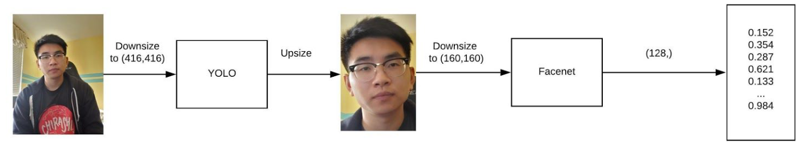

<!-- Readme Start here -->

<!-- Load logo from readme/logo.jpg -->

  

<!-- Title -->
<h1 align="center" style="border: none">
Detecting Face with YoloV3 and Facenet
</h1>

<!-- Shield IO - very nice icons -->

[![Contributors][contributors_shield]][contributors_url]
[![Forks][forks_shield]][forks_url]
[![Stargazers][stars_shield]][stars_url]
[![Issues][issues_shield]][issues_url]
[![MIT License][license_shield]][license_url]
[![LinkedIn][linkedin_shield]][linkedin_url]

<!-- Description -->
The goal of this experiment is to perform facial recognition on a group of people utilizing existing and well-developed technologies such as Facenet and YoloV3.

Given a set of images, the program will use the pre-trained YoloV3 model to extract faces from those images. Then, it will feed those extracted faces into the pre-trained Facenet model to map those faces onto 128 axes space.

The classification is based on some threshold of the euclidean distance between points derived from anchors or most probable images belonging to a desired group and points derived from some images.

## Requirements
- [Data/Models]

## Setup
For Windows:

    conda env create -f ./winRequirements.yml

For MacOS:

    conda env create -f ./macRequirements.yml

Run the program:

    python ./main.py --tau 1.0 --show

## Report
- [Full Report]
- [Collected Data]

<!-- Include your major tools and frameworks -->
## Built With
- [Python]
- [TensorFlow]

<!-- Collaborators information -->
## Collaborators
- [Sotheanith Sok]
- [Alex Pahm]
- [Grant Chen]

## Course
 - [CECS 551 - Advanced Artificial Intelligence]

<!-- License -->
## License
This project is licensed under the MIT License - see the [LICENSE.md][license_url] file for details

<!-- Shoutout to other projects, plugin, or minor tools -->
## Acknowledgments
Special thank to
- [Best-README-Template] - the readme template.
- [Thanh Nguyen] - pre-trained YoloV3 model.
- [Hiroki Taniai] - pre-trained FaceNet model.
- [Schroff et al] - resources on FaceNet.
- [Jason Brownlee] - resources on FaceNet.

<!-- References -->
<!-- Shield Icons-->
[contributors_shield]: https://img.shields.io/github/contributors/sotheanithsok/Detecting-Face-with-YoloV3-and-Facenet.svg?style=for-the-badge
[forks_shield]: https://img.shields.io/github/forks/sotheanithsok/Detecting-Face-with-YoloV3-and-Facenet.svg?style=for-the-badge
[stars_shield]: https://img.shields.io/github/stars/sotheanithsok/Detecting-Face-with-YoloV3-and-Facenet.svg?style=for-the-badge
[issues_shield]: https://img.shields.io/github/issues/sotheanithsok/Detecting-Face-with-YoloV3-and-Facenet.svg?style=for-the-badge
[license_shield]: https://img.shields.io/github/license/sotheanithsok/Detecting-Face-with-YoloV3-and-Facenet.svg?style=for-the-badge
[linkedin_shield]: https://img.shields.io/badge/-LinkedIn-black.svg?style=for-the-badge&logo=linkedin&colorB=555

<!-- Shield URLs -->
[contributors_url]: https://github.com/sotheanithsok/Detecting-Face-with-YoloV3-and-Facenet/graphs/contributors
[forks_url]: https://github.com/sotheanithsok/Detecting-Face-with-YoloV3-and-Facenet/network/members
[stars_url]: https://github.com/sotheanithsok/Detecting-Face-with-YoloV3-and-Facenet/stargazers
[issues_url]: https://github.com/sotheanithsok/Detecting-Face-with-YoloV3-and-Facenet/issues
[license_url]: https://github.com/sotheanithsok/Detecting-Face-with-YoloV3-and-Facenet/blob/master/LICENSE
[linkedin_url]: https://www.linkedin.com/in/sotheanith-sok-969ab0b3/

<!-- Requirements -->
[Data/Models]:https://mega.nz/folder/W2JwgZrb#3fbukdnLG308Brw5wpblMw

<!-- Reports -->
[Full Report]:report/Report.pdf
[Collected Data]:report/Result.xlsx

<!-- Built With -->
[Python]: https://www.python.org/
[TensorFlow]:https://www.tensorflow.org/

<!-- Collaborators -->
[Sotheanith Sok]: https://github.com/sotheanithsok
[Alex Pahm]:https://github.com/alexpham095
[Grant Chen]:https://github.com/reizero01

<!-- Courses -->
[CECS 551 - Advanced Artificial Intelligence]: http://catalog.csulb.edu/preview_course_nopop.php?catoid=5&coid=40041

<!-- Acknowledgments -->
[Best-README-Template]: https://github.com/othneildrew/Best-README-Template
[NeetCode]: https://www.youtube.com/c/NeetCode/
[Thanh Nguyen]:https://github.com/sthanhng/yoloface
[Hiroki Taniai]:https://github.com/nyoki-mtl
[Schroff et al]:https://arxiv.org/abs/1503.03832
[Jason Brownlee]:https://machinelearningmastery.com/how-to-develop-a-face-recognition-system-using-facenet-in-keras-and-an-svm-classifier/

